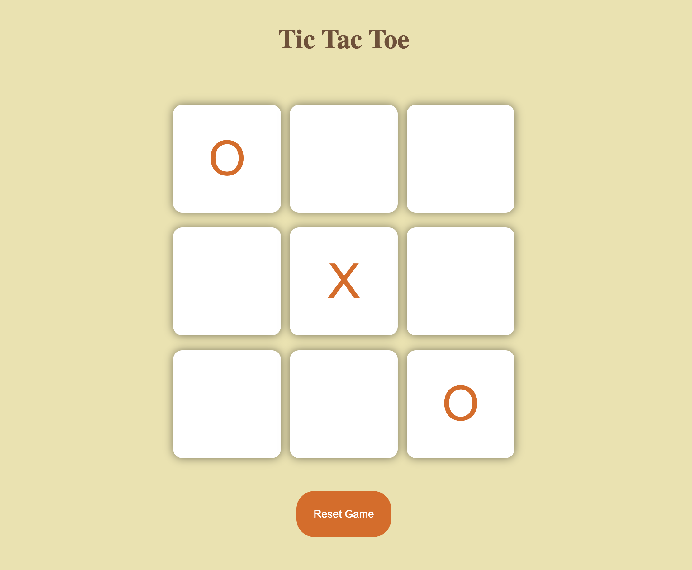

# Tic Tac Toe Game ❌ ⭕

**Tic Tac Toe** game built using **HTML**, **CSS**, and **JavaScript**.

## About this project 🚀

I created this project to **practice and understand core JavaScript concepts** such as DOM manipulation, event handling, conditional logic, and managing game state.

The game allows two players to take turns marking ❌ and ⭕ on a 3×3 grid. It checks for winning combinations after each move, declares the winner or a draw, and updates the UI dynamically based on the game result.

### Technologies 🛠️

- `HTML`
- `CSS`
- `JavaScript`

### 🎥 Demo / 🖼️ Screenshot

## Note

- Built for desktop — responsiveness not included.

### Live Demo: https://areebamoosa.github.io/Tic-Tac-Toe/ 
